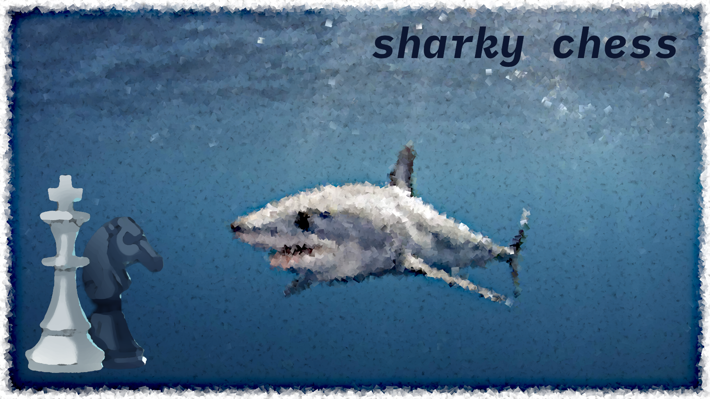

# sharky chess engine

## Prerequisites

Your system needs to have `make` and `gcc` installed.

## Make commands

1. To build, run `make`. Executable `sharky` will be in `./build` directory.
2. To test, run `make test`. Executable `tests` will be in `./build` directory.
3. To clean the project, run `make clean`.

## Perft

Perft is included as a stand alone executable. To build it, run `make perft`. You can then run the executable `./build/perft`.

## Contributing

Please take a look at the source code. Feel free to submit a PR or 2, if you spot something that you can improve.

## License

See [LICENSE](LICENSE) for more details.
