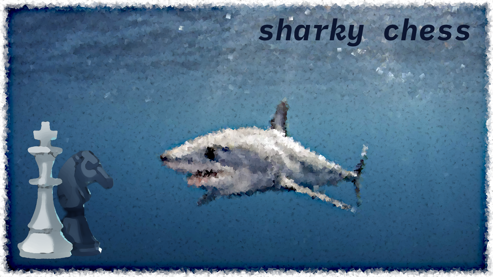

# sharky

sharky chess engine

## about

[](https://travis-ci.org/valera-rozuvan/sharky)



Sharky is a UCI chess engine written in C. It plays random legal moves (for now).

## building

### prerequisites

Your system needs to have `make` and `gcc` installed.

### make commands

1. To build, run `make`. Executable `sharky` will be in `./build` directory.
2. To test, run `make test`. Executable `tests` will be in `./build` directory.
3. To clean the project, run `make clean`.

## perft

Perft is provided as a stand alone executable. To build it, run `make perft`. You can then run the executable `./build/perft`. Please provide depth via `--depth` or `-d` CLI param, and position as a FEN string via `--fen` or `-f` CLI param.

For example:

```
./build/perft --depth 5 --fen "rnbqkbnr/pppppppp/8/8/8/8/PPPPPPPP/RNBQKBNR w KQkq - 0 1"
./build/perft -d 5 -f "rnbqkbnr/pppppppp/8/8/8/8/PPPPPPPP/RNBQKBNR w KQkq - 0 1"
```

## contributing

Please take a look at the source code. Feel free to submit a PR or 2, if you spot something that you can improve.

## roadmap

There are quite a few things planned for Sharky. Some of them are listed in [roadmap.md](docs/roadmap.md) file.

---

## license

The project `'sharky'` is licensed under the MIT License.

See [LICENSE](./LICENSE) for more details.

The latest source code can be retrieved from one of several mirrors:

1. [github.com/valera-rozuvan/sharky](https://github.com/valera-rozuvan/sharky)

2. [gitlab.com/valera-rozuvan/sharky](https://gitlab.com/valera-rozuvan/sharky)

3. [git.rozuvan.net/sharky](https://git.rozuvan.net/sharky)

Copyright (c) 2019-2022 [Valera Rozuvan](https://valera.rozuvan.net/)
